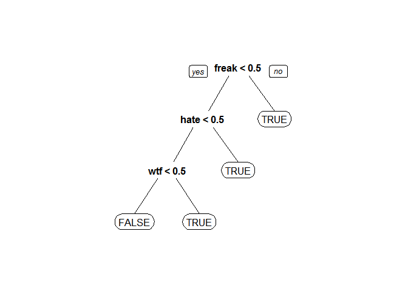

Unit 5 Twitter
================
Vinyas
18 May 2016

##### Loading the data

``` r
tweets=read.csv("Data Files/tweets.csv")
```

##### Create dependent variable

``` r
tweets$Negative = as.factor(tweets$Avg <= -1)

table(tweets$Negative)
```

    ## 
    ## FALSE  TRUE 
    ##   999   182

##### Load required packages

``` r
library(tm)
```

    ## Loading required package: NLP

``` r
library(SnowballC)
```

Create corpus
=============

``` r
corpus = Corpus(VectorSource(tweets$Tweet))

# Look at corpus
corpus
```

    ## <<VCorpus>>
    ## Metadata:  corpus specific: 0, document level (indexed): 0
    ## Content:  documents: 1181

``` r
corpus[[1]]$content
```

    ## [1] "I have to say, Apple has by far the best customer care service I have ever received! @Apple @AppStore"

##### Convert to lower-case

``` r
corpus = tm_map(corpus, content_transformer(tolower))

corpus[[1]]$content
```

    ## [1] "i have to say, apple has by far the best customer care service i have ever received! @apple @appstore"

##### Remove punctuation

``` r
corpus = tm_map(corpus, removePunctuation)

corpus[[1]]$content
```

    ## [1] "i have to say apple has by far the best customer care service i have ever received apple appstore"

##### Look at stop words

``` r
stopwords("english")[1:10]
```

    ##  [1] "i"         "me"        "my"        "myself"    "we"       
    ##  [6] "our"       "ours"      "ourselves" "you"       "your"

``` r
# Remove stopwords and apple

corpus = tm_map(corpus, removeWords, c("apple", stopwords("english")))

corpus[[1]]$content
```

    ## [1] "   say    far  best customer care service   ever received  appstore"

##### Stem document

``` r
corpus = tm_map(corpus, stemDocument)

corpus[[1]]$content
```

    ## [1] "   say    far  best custom care servic   ever receiv  appstor"

##### Create matrix

``` r
frequencies = DocumentTermMatrix(corpus)

frequencies
```

    ## <<DocumentTermMatrix (documents: 1181, terms: 3289)>>
    ## Non-/sparse entries: 8980/3875329
    ## Sparsity           : 100%
    ## Maximal term length: 115
    ## Weighting          : term frequency (tf)

``` r
# Look at matrix 

inspect(frequencies[1000:1005,505:515])
```

    ## <<DocumentTermMatrix (documents: 6, terms: 11)>>
    ## Non-/sparse entries: 1/65
    ## Sparsity           : 98%
    ## Maximal term length: 9
    ## Weighting          : term frequency (tf)
    ## 
    ##       Terms
    ## Docs   cheapen cheaper check cheep cheer cheerio cherylcol chief chiiiiqu
    ##   1000       0       0     0     0     0       0         0     0        0
    ##   1001       0       0     0     0     0       0         0     0        0
    ##   1002       0       0     0     0     0       0         0     0        0
    ##   1003       0       0     0     0     0       0         0     0        0
    ##   1004       0       0     0     0     0       0         0     0        0
    ##   1005       0       0     0     0     1       0         0     0        0
    ##       Terms
    ## Docs   child children
    ##   1000     0        0
    ##   1001     0        0
    ##   1002     0        0
    ##   1003     0        0
    ##   1004     0        0
    ##   1005     0        0

``` r
# Check for sparsity

findFreqTerms(frequencies, lowfreq=20)
```

    ##  [1] "android"              "anyon"                "app"                 
    ##  [4] "appl"                 "back"                 "batteri"             
    ##  [7] "better"               "buy"                  "can"                 
    ## [10] "cant"                 "come"                 "dont"                
    ## [13] "fingerprint"          "freak"                "get"                 
    ## [16] "googl"                "ios7"                 "ipad"                
    ## [19] "iphon"                "iphone5"              "iphone5c"            
    ## [22] "ipod"                 "ipodplayerpromo"      "itun"                
    ## [25] "just"                 "like"                 "lol"                 
    ## [28] "look"                 "love"                 "make"                
    ## [31] "market"               "microsoft"            "need"                
    ## [34] "new"                  "now"                  "one"                 
    ## [37] "phone"                "pleas"                "promo"               
    ## [40] "promoipodplayerpromo" "realli"               "releas"              
    ## [43] "samsung"              "say"                  "store"               
    ## [46] "thank"                "think"                "time"                
    ## [49] "twitter"              "updat"                "use"                 
    ## [52] "via"                  "want"                 "well"                
    ## [55] "will"                 "work"

``` r
# Remove sparse terms

sparse = removeSparseTerms(frequencies, 0.995)
sparse
```

    ## <<DocumentTermMatrix (documents: 1181, terms: 309)>>
    ## Non-/sparse entries: 4669/360260
    ## Sparsity           : 99%
    ## Maximal term length: 20
    ## Weighting          : term frequency (tf)

``` r
# Convert to a data frame

tweetsSparse = as.data.frame(as.matrix(sparse))
```

``` r
# Make all variable names R-friendly

colnames(tweetsSparse) = make.names(colnames(tweetsSparse))

# Add dependent variable

tweetsSparse$Negative = tweets$Negative

# Split the data

library(caTools)

set.seed(123)

split = sample.split(tweetsSparse$Negative, SplitRatio = 0.7)

trainSparse = subset(tweetsSparse, split==TRUE)
testSparse = subset(tweetsSparse, split==FALSE)
```

##### Build a CART model

``` r
library(rpart)
library(rpart.plot)

tweetCART = rpart(Negative ~ ., data=trainSparse, method="class")

prp(tweetCART)
```

<!-- -->

##### Evaluate the performance of the model

``` r
predictCART = predict(tweetCART, newdata=testSparse, type="class")

table(testSparse$Negative, predictCART)
```

    ##        predictCART
    ##         FALSE TRUE
    ##   FALSE   294    6
    ##   TRUE     37   18

``` r
# Compute accuracy

sum(diag(table(testSparse$Negative, predictCART)))/nrow(testSparse)
```

    ## [1] 0.8788732

``` r
# Baseline accuracy 

table(testSparse$Negative)
```

    ## 
    ## FALSE  TRUE 
    ##   300    55

``` r
table(testSparse$Negative)[1]/sum(table(testSparse$Negative))
```

    ##     FALSE 
    ## 0.8450704

##### Random forest model

``` r
library(randomForest)
```

    ## randomForest 4.6-12

    ## Type rfNews() to see new features/changes/bug fixes.

``` r
set.seed(123)

tweetRF = randomForest(Negative ~ ., data=trainSparse)

# Make predictions:
predictRF = predict(tweetRF, newdata=testSparse)

table(testSparse$Negative, predictRF)
```

    ##        predictRF
    ##         FALSE TRUE
    ##   FALSE   293    7
    ##   TRUE     34   21

``` r
#Accuracy
sum(diag(table(testSparse$Negative,predictRF)))/nrow(testSparse)
```

    ## [1] 0.884507

##### Logistic regression model

{r logmodel}

tweetLog = glm(Negative ~ ., data=trainSparse, family="binomial")

predictLog = predict(tweetLog, newdata=testSparse, type="response")

table(testSparse$Negative, predictLog &gt; 0.5)

sum(diag(table(testSparse$Negative,predictLog&gt;0.5 )))/nrow(testSparse)

\`\`\`

###### The accuracy is (254+37)/(254+46+18+37) = 0.8197183, which is worse than the baseline. If you were to compute the accuracy on the training set instead, you would see that the model does really well on the training set - this is an example of over-fitting. The model fits the training set really well, but does not perform well on the test set. A logistic regression model with a large number of variables is particularly at risk for overfitting.

Note that you might have gotten a different answer than us, because the glm function struggles with this many variables. The warning messages that you might have seen in this problem have to do with the number of variables, and the fact that the model is overfitting to the training set.
