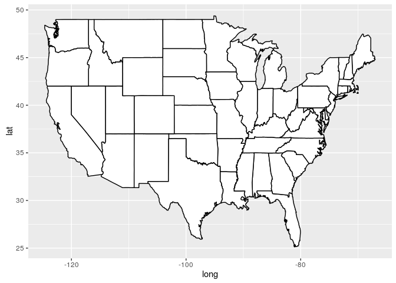
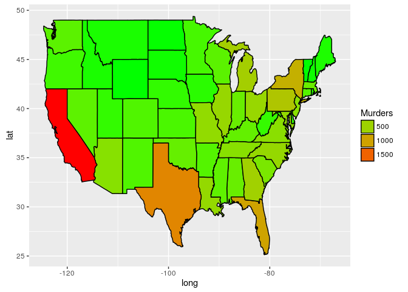
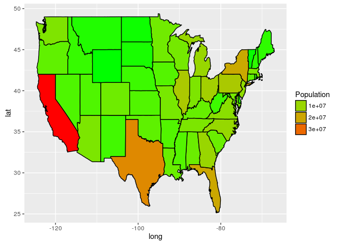
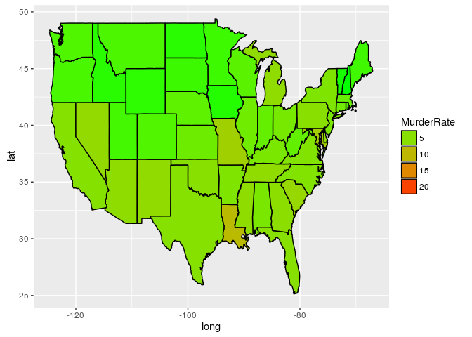
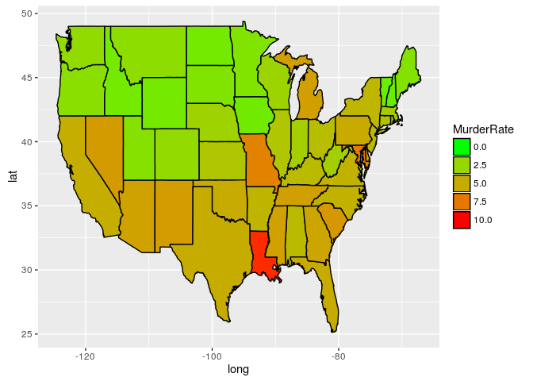

Unit 7 Crime Rate
================

##### Load our data

``` r
library(ggmap)
library(maps)
murders = read.csv("murders.csv")

str(murders)
```

##### Load the map of the US

``` r
statesMap = map_data("state")

str(statesMap)
```

##### Plot the map

``` r
ggplot(statesMap, aes(x = long, y = lat, group = group)) + geom_polygon(fill = "white", color = "black") 
```



##### Create a new variable called region with the lowercase names to match the statesMap

``` r
murders$region = tolower(murders$State)

# Join the statesMap data and the murders data into one dataframe
murderMap = merge(statesMap, murders, by="region")
str(murderMap)
```

##### Plot the number of murder on our map of the United States

``` r
ggplot(murderMap, aes(x = long, y = lat, group = group, fill = Murders)) + geom_polygon(color = "black") + scale_fill_gradient(low = "green", high = "red", guide = "legend")
```



``` r
# Plot a map of the population
ggplot(murderMap, aes(x = long, y = lat, group = group, fill = Population)) + geom_polygon(color = "black") + scale_fill_gradient(low = "green", high = "red", guide = "legend")
```



##### Create a new variable that is the number of murders per 100,000 population

``` r
murderMap$MurderRate = murderMap$Murders / murderMap$Population * 100000

# Redo our plot with murder rate
ggplot(murderMap, aes(x = long, y = lat, group = group, fill = MurderRate)) + geom_polygon(color = "black") + scale_fill_gradient(low = "green", high = "red", guide = "legend")
```



``` r
# Redo the plot, removing any states with murder rates above 10
ggplot(murderMap, aes(x = long, y = lat, group = group, fill = MurderRate)) + geom_polygon(color = "black") + scale_fill_gradient(low = "green", high = "red", guide = "legend", limits = c(0,10))
```


