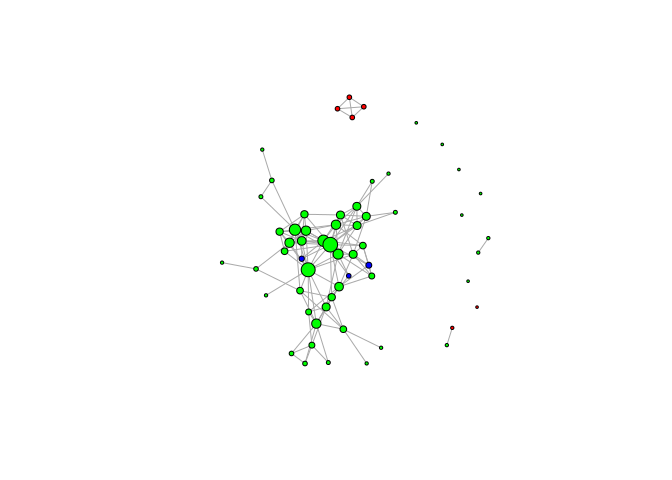

Unit 7 Network Viz
================

##### Load the data

``` r
edges=read.csv("edges.csv")
users=read.csv("users.csv")
str(edges)
str(users)
```

##### what is the average number of friends per user?

From str(edges) or nrow(edges), we see that there are 146 pairs of users in our dataset who are Facebook friends. However, each pair (A, B) must be counted twice, because B is a friend of A and A is a friend of B. To think of this in simpler terms, consider a network with just new people, A and B, and a single edge (A, B). Even though there are two vertices and one edge, each user has on average one friend.

For our network, the average number of friends per user is 292/59=4.95.

##### Make a graph object

``` r
library(igraph)
g = graph.data.frame(edges, FALSE, users) 
```

The function expects the first two columns of parameter d to specify the edges in the graph -- our edges object fits this description Our edges are undirected -- if A is a Facebook friend of B then B is a Facebook friend of A. Therefore, set the directed parameter to FALSE. The vertices parameter expects a data frame where the first column is a vertex id and the remaining columns are properties of vertices in our graph. This is the case with our users data frame. &lt;&gt;A directed graph is one where the edges only go one way -- they point from one vertex to another. The other option is an undirected graph, which means that the relations between the vertices are symmetric.

###### need to know more about edges and vertices

##### we want to plot our graph. By default, the vertices are large and have text labels of a user's identifier. Because this would clutter the output, we will plot with no text labels and smaller vertices

``` r
plot(g, vertex.size=5, vertex.label=NA)
```


##### How many users are friends with 10 or more other Facebook users in this network?

``` r
table(degree(g)>=10)
```

    ## 
    ## FALSE  TRUE 
    ##    50     9

##### change the size of the vertices so the vertices with high degrees are larger. To do this, we will change the "size" attribute of the vertices of our graph to be an increasing function of their degrees

``` r
V(g)$size = degree(g)/2+2
#Find more about V()
```

##### What is the largest size we assigned to any node in our graph?

``` r
max(V(g)$size)
```

    ## [1] 11

``` r
min(V(g)$size)
```

    ## [1] 2

``` r
#Plot to show th changes
plot(g, vertex.label=NA)
```


##### Update the colors by setting the color to black for all vertices, then setting it to red for the vertices with gender A and setting it to gray for the vertices with gender B

``` r
V(g)$color = "black"
V(g)$color[V(g)$gender == "A"] = "red"
V(g)$color[V(g)$gender == "B"] = "gray"
plot(g, vertex.label=NA)
```


``` r
#All the largest nodes (the ones with the highest degree) are colored gray, which corresponds to Gender B.
```

##### Color the vertices based on the school that each user in our network attended.

``` r
V(g)$color = "blue"
V(g)$color[V(g)$school == "A"] = "red"
V(g)$color[V(g)$school == "AB"] = "green"
plot(g, vertex.label=NA)
```


``` r
#The two students who attended schools A and B are colored gray; we can see from the graph that they are Facebook friends (aka they are connected by an edge).
#The high-degree users (depicted by the large nodes) are a mixture of red and black color, meaning some of these users attended school A and other did not.
```

##### color the vertices based on the locale of the user.

``` r
V(g)$color = "blue"
V(g)$color[V(g)$locale == "A"] = "red"
V(g)$color[V(g)$locale == "B"] = "green"
plot(g, vertex.label=NA)
```


