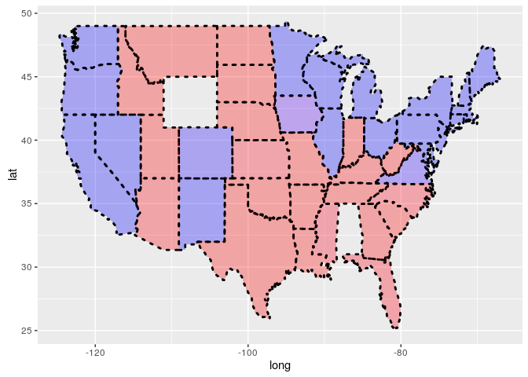

Unit 7 Polling
================

##### Load the US map and save it to the variable statesMap

``` r
library(maps)
library(ggmap)
statesMap=map_data("state")

str(statesMap)
```

##### How many groups in the data frame

``` r
length(table(statesMap$group))
```

    ## [1] 63

##### Read polling.csv and split into train and test set

``` r
polling=read.csv("PollingImputed.csv")
train=subset(polling,polling$Year==2004 | polling$Year==2008)
test=subset(polling,polling$Year==2012)
```

##### make a logistic model and predict for test set

``` r
mod2 = glm(Republican~SurveyUSA+DiffCount, data=train, family="binomial")

TestPrediction = predict(mod2, newdata=test, type="response")
TestPredictionBinary = as.numeric(TestPrediction > 0.5)
predictionDataFrame=data.frame(TestPrediction,TestPredictionBinary,test$State)
```

##### Merge data frames

``` r
#merge "predictionDataFrame" with the map data "statesMap"
#Convert to lower so case matches with the other data frame
predictionDataFrame$region = tolower(predictionDataFrame$test.State)
predictionMap = merge(statesMap, predictionDataFrame, by = "region")
#When we merge data, it only merged the observations that exist in both data sets. So since we are merging based on the region variable, we will lose all observations that have a value of "region" that doesn't exist in both data frames. We can change this default behavior by using the all.x and all.y arguments of the merge function.
```

##### Make sure the observations are in order so that the map is drawn properly

``` r
predictionMap = predictionMap[order(predictionMap$order),]
```

``` r
ggplot(predictionMap, aes(x = long, y = lat, group = group, fill = TestPrediction))+ geom_polygon(color = "black",linetype=3,alpha=0.3,size=1) + scale_fill_gradient(low = " blue", high = "red", guide = "legend", breaks= c(0,1), labels = c("Democrat", "Republican"), name = "Prediction 2012")
```



``` r
#Changing alpha will give lighter colours
#size changes the border size
#line type changes the border line type of the ploygon
```
