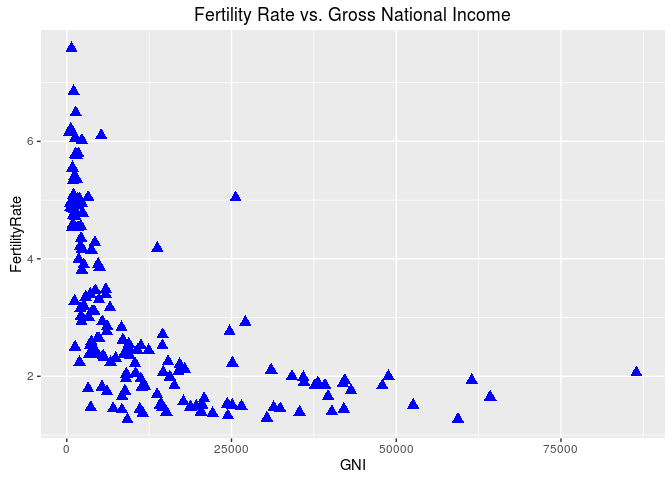

Unit 7 Visualization
================

``` r
knitr::opts_chunk$set(echo = T,warning=FALSE,message = F)
```

All ggplot graphics consist of three elements. The first is data, in a data frame. The second is an aesthetic mapping, which describes how variables in the data frame are mapped to graphical attributes. This is where we'll define which variables are on the x-and y-axes, whether or not points should be colored or shaped by certain attributes, etc. The third element is which geometric objects we want to determine how the data values are rendered graphically. This is where we indicate if the plot should have points, lines, bars, boxes, etc.

##### Basic Scatterplots

``` r
library(ggplot2)

WHO = read.csv("WHO.csv")

str(WHO)
```

##### Create the ggplot object with the data and the aesthetic mapping:

``` r
scatterplot = ggplot(WHO, aes(x = GNI, y = FertilityRate))
```

###### Add the geom\_point geometry

``` r
scatterplot + geom_point()
```


##### Redo the plot with blue triangles instead of circles:

``` r
scatterplot + geom_point(color = "blue", size = 3, shape = 17) 
```

 \#\#\#\#\# Another option:

``` r
scatterplot + geom_point(color = "darkred", size = 3, shape = 8) 
```


##### Add a title to the plot:

``` r
scatterplot + geom_point(colour = "blue", size = 3, shape = 17) + ggtitle("Fertility Rate vs. Gross National Income")
```



##### Save our plot:

``` r
fertilityGNIplot = scatterplot + geom_point(colour = "blue", size = 3, shape = 17) + ggtitle("Fertility Rate vs. Gross National Income")
```

##### We ca nknow more about colours via

``` r
colours()
```

##### Color the points by region

``` r
ggplot(WHO, aes(x = GNI, y = FertilityRate, color = Region)) + geom_point()
```


##### Color the points according to life expectancy

``` r
ggplot(WHO, aes(x = GNI, y = FertilityRate, color = LifeExpectancy)) + geom_point()
```


##### Is the fertility rate of a country was a good predictor of the percentage of the population under 15?

``` r
ggplot(WHO, aes(x = FertilityRate, y = Under15)) + geom_point()
```


##### Let's try a log transformation:

``` r
ggplot(WHO, aes(x = log(FertilityRate), y = Under15)) + geom_point()
```


##### Simple linear regression model to predict the percentage of the population under 15, using the log of the fertility rate:

``` r
mod = lm(Under15 ~ log(FertilityRate), data = WHO)
summary(mod)
```

    ## 
    ## Call:
    ## lm(formula = Under15 ~ log(FertilityRate), data = WHO)
    ## 
    ## Residuals:
    ##      Min       1Q   Median       3Q      Max 
    ## -10.3131  -1.7742   0.0446   1.7440   7.7174 
    ## 
    ## Coefficients:
    ##                    Estimate Std. Error t value Pr(>|t|)    
    ## (Intercept)          7.6540     0.4478   17.09   <2e-16 ***
    ## log(FertilityRate)  22.0547     0.4175   52.82   <2e-16 ***
    ## ---
    ## Signif. codes:  0 '***' 0.001 '**' 0.01 '*' 0.05 '.' 0.1 ' ' 1
    ## 
    ## Residual standard error: 2.65 on 181 degrees of freedom
    ##   (11 observations deleted due to missingness)
    ## Multiple R-squared:  0.9391, Adjusted R-squared:  0.9387 
    ## F-statistic:  2790 on 1 and 181 DF,  p-value: < 2.2e-16

``` r
# Add this regression line to our plot:
ggplot(WHO, aes(x = log(FertilityRate), y = Under15)) + geom_point() + stat_smooth(method = "lm")
```


##### 99% confidence interval

``` r
ggplot(WHO, aes(x = log(FertilityRate), y = Under15)) + geom_point() + stat_smooth(method = "lm", level = 0.99)
```


``` r
# No confidence interval in the plot
ggplot(WHO, aes(x = log(FertilityRate), y = Under15)) + geom_point() + stat_smooth(method = "lm", se = FALSE)
```


``` r
# Change the color of the regression line:
ggplot(WHO, aes(x = log(FertilityRate), y = Under15)) + geom_point() + stat_smooth(method = "lm", colour = "orange")
```


##### One region in particular has a lot of countries with a very low fertility rate and a very low percentage of the population under 15. Which region is it?

``` r
ggplot(WHO, aes(x = FertilityRate, y = Under15,color=Region)) + geom_point() + scale_color_brewer(palette="Dark2")
```


